# Workflow Maps — GigAnalytics Core User Workflows

**Synthesized from:** Competitor UX analysis, forum mining, empathy maps, journey maps  
**Date:** April 2026  
**Format:** Mermaid flowcharts (render in GitHub, VS Code, Notion) + annotated step descriptions

---

## How to Read These Diagrams

Each workflow shows:
- **Current State (AS-IS):** How users do this today, with all friction points marked 🔴
- **Target State (TO-BE):** How GigAnalytics should handle the same workflow
- **Friction annotations:** Where users drop off, make errors, or experience pain

---

## Workflow 1: Capture Time Against Income Stream

### AS-IS: Current User Workflow (Painful)

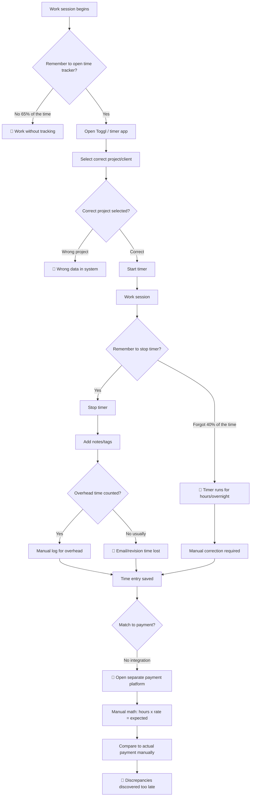

**Friction Points Identified:**
1. 🔴 **Forgetting to start timer** — 65% of sessions start untimed (estimated from forum patterns)
2. 🔴 **Wrong project selected** — Especially when switching rapidly between clients
3. 🔴 **Forgetting to stop timer** — Creates phantom hours that must be manually corrected
4. 🔴 **Overhead time excluded** — Email, revisions, proposals never make it into any system
5. 🔴 **No payment linkage** — Time tool and payment tool are completely separate
6. 🔴 **Late reconciliation** — Discrepancy discovered weeks later during monthly review

---

### TO-BE: GigAnalytics Workflow (Target)

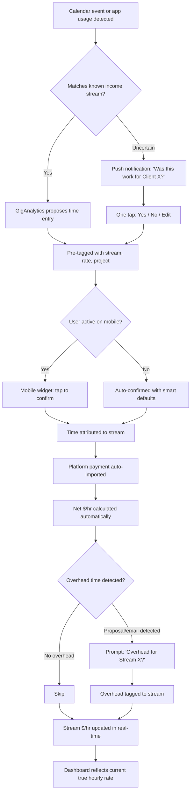

**GigAnalytics Improvements:**
1. ✅ **Calendar inference** eliminates 65% of "forgot to start" failures
2. ✅ **One-tap confirmation** reduces logging to < 5 seconds
3. ✅ **Smart defaults** (previous stream assignment) reduce wrong-project selections
4. ✅ **Overhead prompting** surfaces invisible time costs
5. ✅ **Auto-payment import** connects time to revenue automatically
6. ✅ **Real-time $/hr** visible immediately — no manual reconciliation

---

## Workflow 2: Monthly Income Reconciliation

### AS-IS: Current User Workflow (Painful)

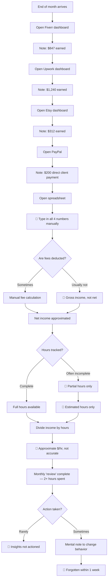

**Key Pain:** This workflow takes 2+ hours monthly. The output (approximate $/hr) is inaccurate. Even when insights are generated, they're not actioned because they're buried in a spreadsheet nobody revisits.

---

### TO-BE: GigAnalytics Workflow (Target)

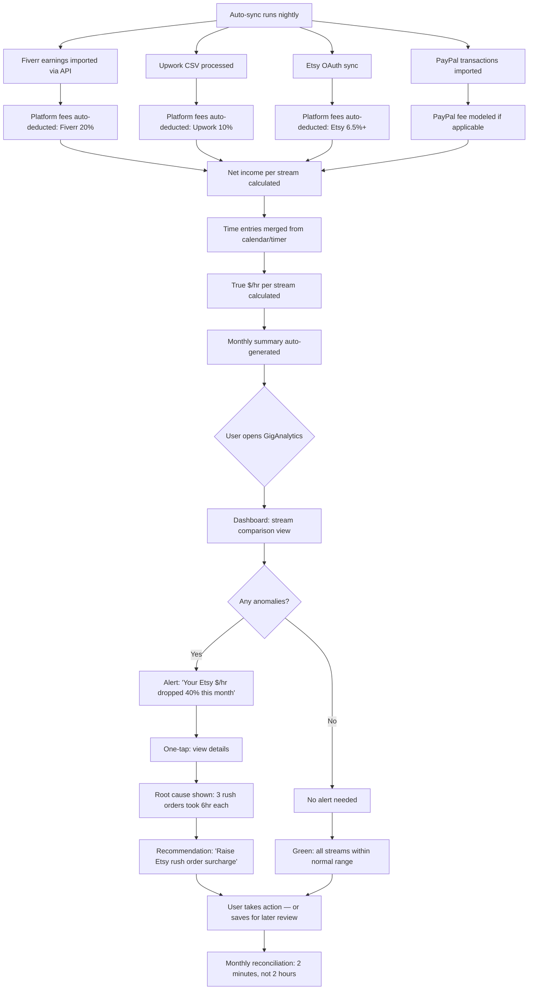

---

## Workflow 3: Payout Reconciliation & Fee Tracking

### AS-IS: Current State

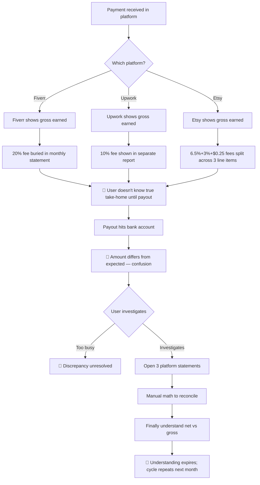

### TO-BE: GigAnalytics Workflow

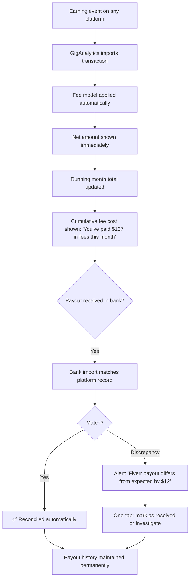

---

## Workflow 4: Price-Setting Decision

### AS-IS: Current State (No Data)

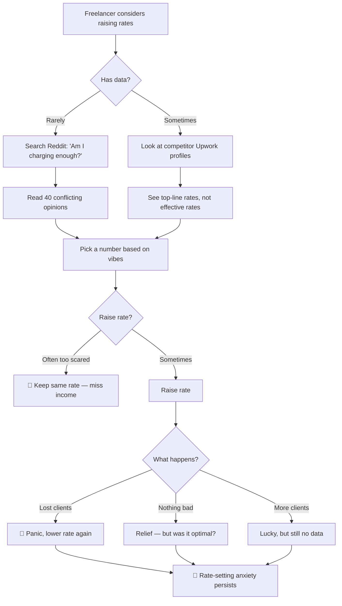

### TO-BE: GigAnalytics Workflow

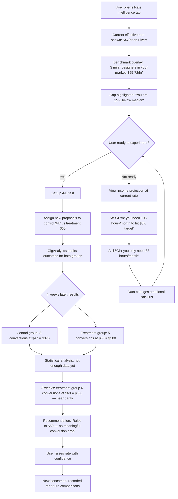

---

## Workflow 5: Platform Scheduling & Time Allocation

### AS-IS: Current State

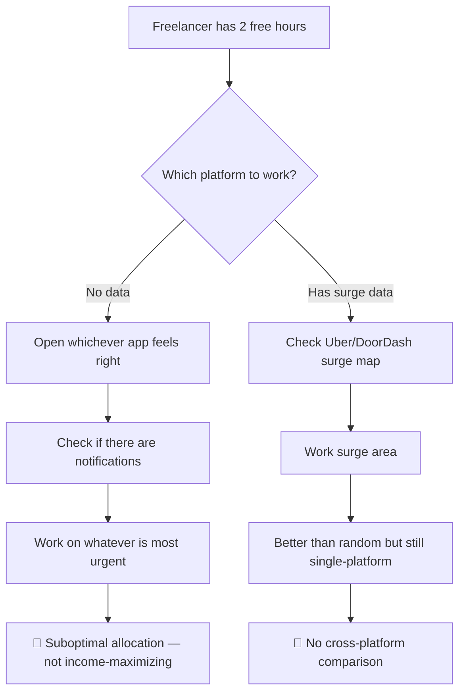

### TO-BE: GigAnalytics Workflow

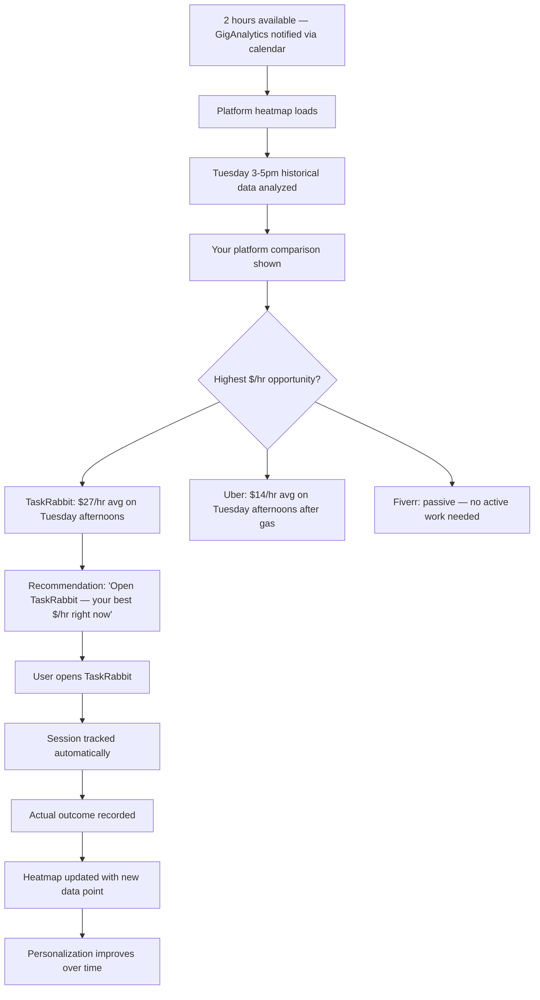

---

## Workflow Summary: Friction Points Eliminated

| Workflow | Current Friction | GigAnalytics Solution | Time Saved |
|---------|-----------------|----------------------|------------|
| Time capture | Forgetting to log; manual entry | Calendar inference + one-tap | ~45 min/week |
| Monthly reconciliation | 2+ hours of manual spreadsheet work | Automatic sync + dashboard | ~2 hours/month |
| Fee tracking | Fees buried; surprises at payout | Real-time fee modeling | ~30 min/month |
| Price-setting | No data; gut feel; fear-driven | Benchmark + A/B experiment | Priceless (enables rate increases) |
| Platform scheduling | Random or single-platform | Cross-platform heatmap | Better $/hr on every session |

**Total estimated time saved per month:** 3-4 hours of manual reconciliation + more efficient working hours
**Total estimated income impact:** 15-30% increase from rate optimization and better platform allocation

---

## Data Flow Architecture (Simplified)

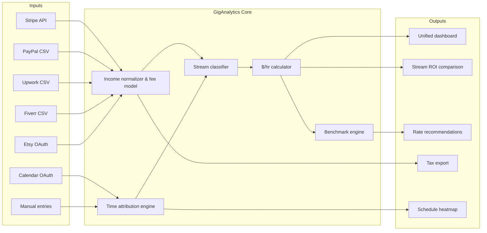
